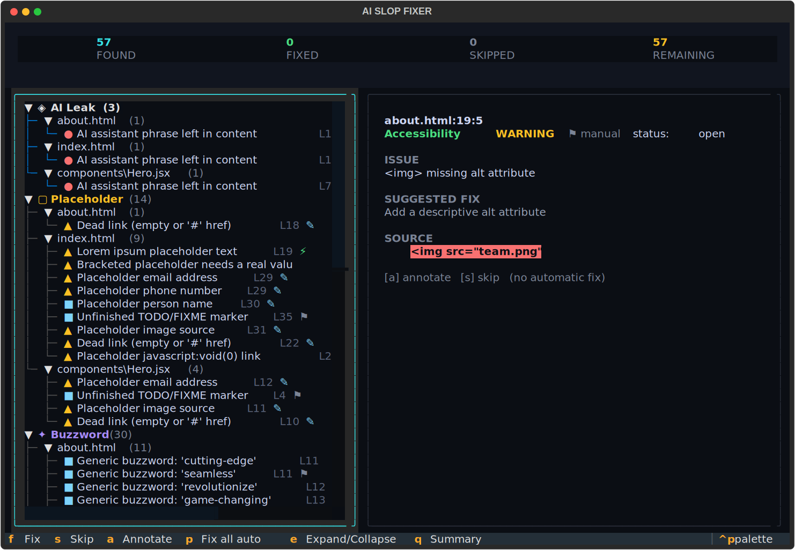
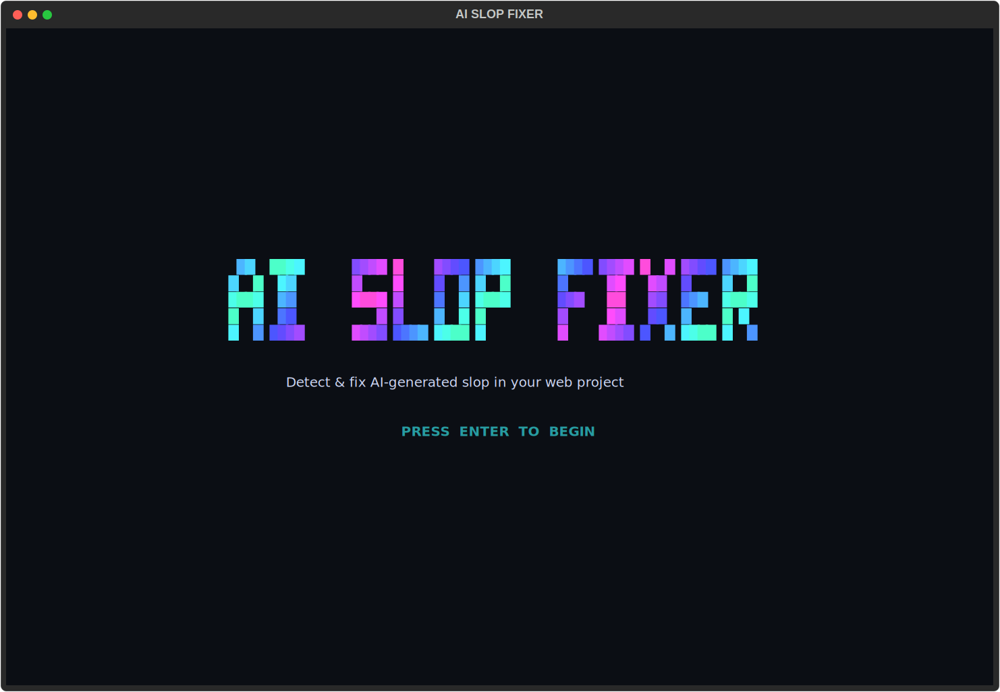
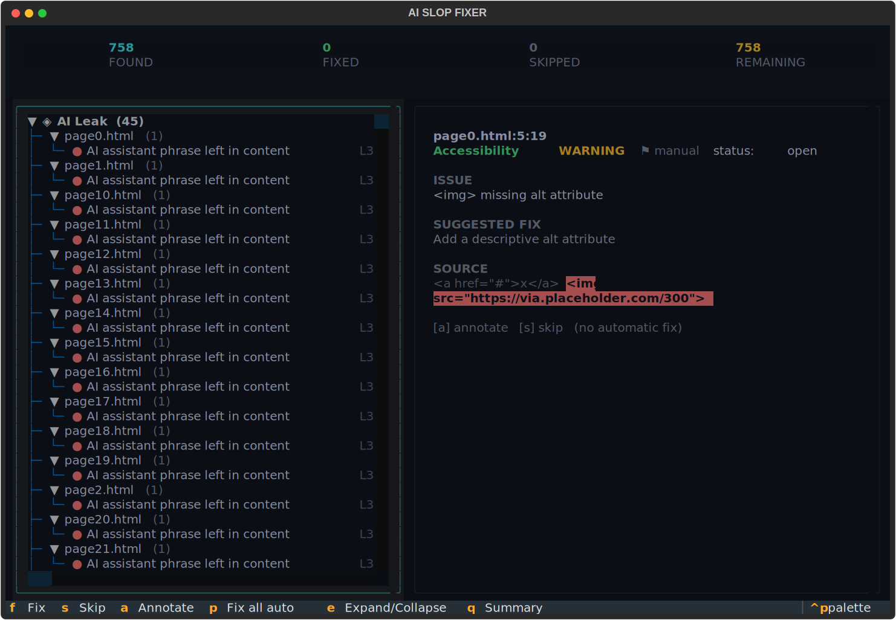
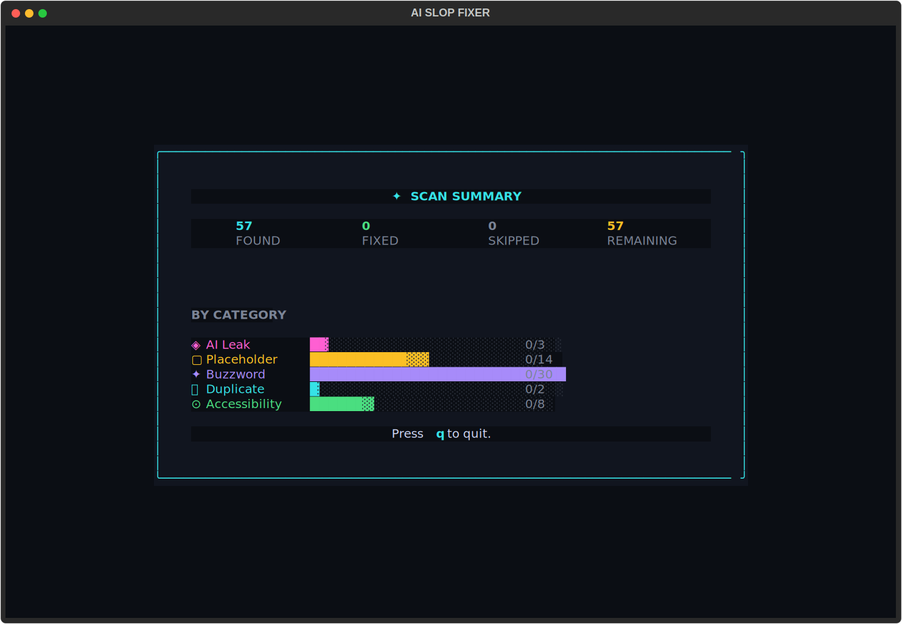

# aislopfixer

> Terminal TUI that finds and fixes **AI-generated slop** in local web projects — fully offline, rule-based, no API keys.

[](https://www.npmjs.com/package/@mertsoylu/aislopfixer)
[](https://pypi.org/project/aislopfixer/)
[](https://www.python.org/)
[](LICENSE)

**Current version: 0.1.1** — [npm](https://www.npmjs.com/package/@mertsoylu/aislopfixer) / [PyPI](https://pypi.org/project/aislopfixer/)

AI coding assistants leave traces everywhere: leftover "Certainly! Here is…" preambles, lorem ipsum, `[Your Company Name]`, dead `href="#"` links, `alt="image"`, and a fog of "cutting-edge, seamless, revolutionary" buzzwords. **aislopfixer** scans your codebase, surfaces every instance in an animated terminal UI, and lets you fix them one keystroke at a time — or all at once.

Everything runs **locally**. No network calls, no LLM, no telemetry. Just deterministic rules.

<p align="center">
  
</p>

---

## Install

```bash
npm install -g @mertsoylu/aislopfixer
aislopfixer ./path/to/site
```

Requires **Python ≥ 3.11** on your machine. On first run the npm launcher builds a small isolated Python environment under `~/.aislopfixer/` (needs internet once), then starts instantly thereafter.

### Or from source (Python)

```bash
pip install -e .
aislopfixer ./path/to/site
python -m aislopfixer ./sample   # module form
```

Try it on the bundled demo:

```bash
aislopfixer ./sample
```

## What it detects

| Category | Examples | Fix |
|----------|----------|-----|
| **AI leaks** | "As an AI language model…", "Certainly! Here is…", "I hope this helps", "Let me know if…" | AUTO / MANUAL |
| **Placeholders / dummy data** | lorem ipsum, `[Your Company Name]`, `example.com`, dummy emails/phones, `TODO`, placeholder images, `href="#"`, `javascript:void(0)` | AUTO / PROMPT |
| **Buzzwords** | "cutting-edge", "seamless", "revolutionize", "unlock the power…" + density flag | MANUAL |
| **Duplicates** | repeated content blocks across files | MANUAL |
| **Accessibility / meta** | missing or `alt="image"`, missing `<title>`, weak meta description, empty headings | PROMPT / MANUAL |
| **Code slop** | elision markers (`// ... existing code ...`), stub bodies/ comments, `debugger;`, throwaway `console.log`, restate-the-code comments, Markdown emoji headers/ checkmark bullets/ boilerplate sections/ bold-lead listicles/ scaffolding lead-ins | AUTO / MANUAL |
| **Prose tells** | "not only … but also", "dive in", "in this article", stock connectives, "when it comes to", em-dash overuse | MANUAL |

## Usage

```bash
aislopfixer [PATH]
```

Run with a path to scan immediately, or run with no argument and enter the path in the UI.

### Keybindings (results view)

| Key | Action |
|-----|--------|
| `f` | fix selected finding |
| `s` | skip / allowlist |
| `a` | annotate |
| `p` | fix all `auto` findings |
| `q` | summary / quit |

### How fixing works

- **auto** — clear junk is deleted or replaced outright (AI leaks, lorem ipsum, empty headings, debugger statements, throwaway console.log, emoji decorations).
- **prompt** — you type the real value (emails, URLs, names, alt text). The template inserts your value into the right place.
- **manual** — flagged only; annotate or skip.

Every file is backed up to `<file>.aislopfixer.bak` before its first edit, and a diff is computed before each write. Findings are relocated by matched text after prior edits, so offsets stay correct across a fix session.

## Features

- **5 rule categories** — AI leaks, placeholders/buzzwords/duplicates/a11y + code slop and prose tells.
- **Multi-framework** — HTML, React (JSX/TSX), Vue, Svelte, Astro, Markdown/MDX, plain JS/TS, CSS.
- **Context-aware** — buzzwords only flag in human-visible prose, never in code identifiers. Self-annotation comments are never re-flagged.
- **Smart placeholder detection** — `[id]`, `[checked]`, `[a-z]`, `[...slug]` (code/framework tokens) are ignored; `[Your Company Name]` is flagged.
- **Code slop detection** — elision markers (`// ... rest of code unchanged`), stub bodies (`throw new Error('Not implemented')`), stub comments (`// your code here`), `debugger;`, throwaway `console.log('here')`, restate-the-code comments.
- **Markdown tells** — emoji-prefixed headers, boilerplate sections, checkmark bullet lists, bold-lead listicles, scaffolding lead-ins.
- **Cross-file duplicate detection** — same prose block pasted across multiple pages.
- **Scoring** — per-finding confidence (0..1), per-file noisy-OR score, self-weighted project score. Confidence drives "fix all auto" thresholds.
- **Allowlist** — confirmed false positives are remembered in `.aislopfixer/allowlist.json`, keyed by content (survives line edits).
- **Persistent ledger** — resolved findings are recorded and suppressed on re-scans. Skipped findings re-surface intentionally.
- **Report** — `.aislopfixer/report.md` written after each scan with category breakdowns.
- **Animated TUI** — built on [Textual](https://textual.textualize.io/). Splash → path picker → scan progress → tree + detail → summary.
- **100% offline** — rule-based, no API keys, no telemetry, no network calls.

## Screenshots

| Splash | Scan |
|--------|------|
|  |  |

| Results | Summary |
|---------|---------|
|  |  |

## Architecture

```
src/aislopfixer/
├── cli.py                    # argparse entrypoint
├── __init__.py               # package metadata
├── __main__.py               # python -m support
├── app.py                    # Textual App, screen orchestration
├── scanner.py                # walks dir, filters by ext/ignore/meta, yields SourceFile
├── fixer.py                  # apply AUTO/PROMPT/MANUAL fixes, backups, diff preview, annotation
├── allowlist.py              # persistent false-positive store (.aislopfixer/allowlist.json)
├── store.py                  # per-project persistence (ledger, report, allowlist)
├── theme.py                  # colors, icons, shimmer gradient
├── styles.tcss               # Textual CSS (250 lines)
├── engine/
│   ├── __init__.py
│   ├── models.py             # SourceFile, Finding, enums (Category, Fixability, Severity, Status)
│   ├── runner.py             # orchestrates rules, dedupes, collapses repeats, backfills confidence
│   ├── registry.py           # @file_rule / @cross_rule decorators — rules self-register at import
│   ├── pattern_rule.py       # base class for regex rules (Pattern dataclass + PatternRule)
│   ├── context.py            # file_kind(), prose_regions(), in_any(), on_annotation_line()
│   ├── scoring.py            # per-finding confidence, per-file noisy-OR, project self-weighted mean
│   ├── util.py               # line_col(), make_snippet(), build_finding()
│   └── rules/
│       ├── ai_leaks.py       # STRONG (AUTO) + SOFT (MANUAL) AI assistant phrases
│       ├── placeholders.py   # lorem ipsum, [brackets], example.com, emails, phones, names,
│       │                     # companies, addresses, TODO, placeholder images, dead/void links
│       ├── buzzwords.py      # 65 marketing words + density threshold
│       ├── prose_tells.py    # "not only...but also", "dive in", em-dash overuse, etc.
│       ├── duplicates.py     # cross-file duplicate prose blocks (conservative, prose-only)
│       ├── accessibility.py  # missing/generic alt, empty headings, no title/meta/lang
│       ├── codegen.py        # elision markers, stub bodies/comments, debugger, logs, restates
│       └── markdown_tells.py # emoji headers, boilerplate sections, checkmark bullets,
│                             # bold-lead lists, scaffolding lead-ins
├── screens/
│   ├── __init__.py
│   ├── splash.py             # animated logo + typewriter effect
│   ├── path.py               # path entry/confirmation
│   ├── scan.py               # progress bar + shimmer
│   ├── results.py            # tree (left) + detail panel (right)
│   ├── summary.py            # per-category counts + score
│   ├── modal.py              # prompt modal for PROMPT fixes
│   └── base.py               # shared screen utilities
└── widgets/
    ├── __init__.py
    ├── logo.py               # ASCII art logo
    ├── animations.py         # shimmer banner, typewriter
    ├── counters.py           # animated counter
    ├── guard.py              # responsive size guard
    └── stats.py              # score display
```

### How rules work

Rules self-register via `@file_rule` (run once per file) / `@cross_rule` (run once over all files) decorators in `registry.py`. The `runner.py` imports the `rules` package to trigger registration.

- `PatternRule` base class handles regex matching for most rules. Each rule declares a list of `Pattern` dataclasses with regex, severity, fixability, guard function, and file-kind restriction.
- `BuzzwordRule` overrides `scan()` to check `prose_regions()` first — buzzwords in code identifiers are ignored.
- `AccessibilityRule` scans HTML/JSX only; document-level checks (`<title>`, `<meta>`, `lang`) apply only to real HTML documents.
- `DuplicateRule` is a cross-file rule that finds identical prose blocks across files.
- `MarkdownTellRule` detects AI-doc signatures: emoji headers, boilerplate "Conclusion/Key Takeaways" sections, checkmark bullet runs, bold-lead listicles, and scaffolding lead-ins.
- `CodeGenRule` catches AI-pasted code artifacts: elision markers, not-implemented stubs, fill-in-the-blank comments, leftover `debugger;`, throwaway `console.log`, and restate-the-code comments.

Dedup: `runner._dedupe()` collapses findings with same `(file, start, end)` — keeps first. Self-annotation filter: lines containing `aislopfixer:` are never re-flagged. Low-value placeholders (company/name/address) are collapsed per file to one finding per distinct value.

### Scanner behavior

- Skips hidden dirs (`.git`, `.aislopfixer`), `node_modules`, `dist`, `build`, `.next`, `vendor`, `__pycache__`, `.turbo`, `.vercel`, `.astro`, etc.
- Skips repo-meta files by stem: `README`, `CLAUDE`, `AGENTS`, `LICENSE`, `CONTRIBUTING`, `CHANGELOG`, etc.
- Max scanned file size: 2MB (`MAX_BYTES`).
- Supported extensions: `.html .htm .jsx .tsx .js .ts .mjs .cjs .vue .svelte .astro .md .mdx .css`.

### Scoring

Every finding gets a confidence score (0..1):
1. **Rule override** — specific rules have pinned confidence (e.g., `ai_leak.strong` → 0.97, `codegen.restate_comment` → 0.30).
2. **Category × severity** — fallback formula per category prior × severity weight.

File score: noisy-OR of all findings in that file. Project score: self-weighted mean of file scores (sloppy files dominate).

## Development

```bash
pip install -e ".[dev]"
pytest
```

- **Stack:** Python ≥ 3.11, [Textual](https://textual.textualize.io/) ≥ 0.80.
- **Dev:** `pytest ≥ 8`, `pytest-asyncio ≥ 0.23` (`asyncio_mode = auto`).

### npm package

The npm package (`@mertsoylu/aislopfixer`) is a thin launcher that:
1. Finds Python ≥ 3.11 on the host.
2. Creates a private venv in `~/.aislopfixer/venv-{version}/` on first run.
3. Pip-installs the bundled Python package (pulls in `textual`).
4. Executes the TUI with the user's args.
5. Cached thereafter — startup is instant.

```bash
npm pack                          # test locally
npm publish                       # publish to npm
```

## License

[MIT](LICENSE) © mertsoylu
